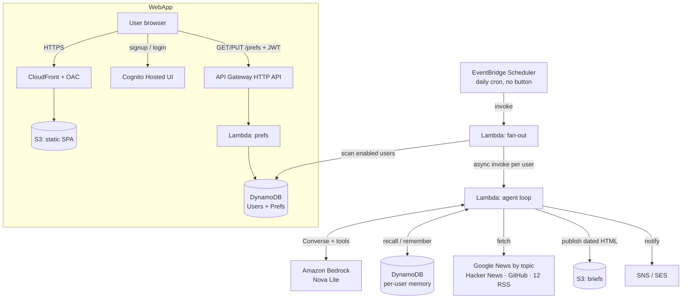
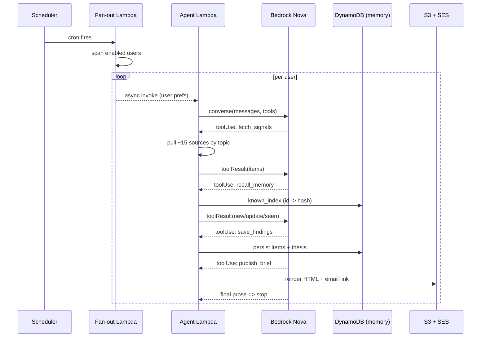

<!--
AWS Builder Center submission for the "Build an Always-On Agent" challenge.
Official Article Requirements:
  - >= 500 words (NO upper limit). This draft is ~3,000 words.
  - Title MUST start with "Weekend Agent Challenge: [Name of Your Agent]"
  - Tag: #agents  (plus optional: bedrock, lambda, serverless, ai)
  - Required sections: Vision & What the Agent Does / How You Built It /
    AWS Services Used / Architecture Overview / What You Learned / Link to App or Repo
Notes:
  - Diagrams are provided as Mermaid (for renderers that support it) with an
    ASCII fallback immediately after each, so they always display.
  - Replace [SCREENSHOT ...] markers before publishing.
-->

# Weekend Agent Challenge: Sift — the agent that reads the internet so you don't have to

*Tag: **#agents*** (also: **#bedrock**, **#lambda**, **#serverless**, **#ai**)

> **TL;DR** — Sift is an always-on, multi-user AI agent. Every morning, with no
> human in the loop, it scans ~15 public sources tuned to each user's chosen
> topics, reasons over them with **Amazon Bedrock Nova** (Converse API + tool
> use), compares everything against **per-user long-term memory** so it never
> repeats a story, and publishes a fresh, personalized HTML brief — then emails a
> link. It runs on a pure serverless backbone (**EventBridge Scheduler → Lambda
> fan-out → Bedrock → DynamoDB → S3/CloudFront**), signs users in with **Cognito**,
> and stores preferences behind an **API Gateway** JWT-authorized endpoint. One
> `sam deploy` stands the whole thing up. Free-tier friendly.

---

## Why I built this (and how the idea arrived)

I have a "read later" list that is really a "read never" list. Every morning I
open five or six tabs — Hacker News, a couple of RSS readers, an AWS blog, GitHub
trending — and I skim the same headlines I skimmed yesterday, hunting for the one
or two things that actually changed. It's a tax I pay before I've even started
working, and I pay it *badly*: I miss things, I re-read things, and I never have a
clean sense of *how a story is evolving over time*.

So I tried the obvious fix — a "daily digest" bot. And that's when the real
problem clicked. **Almost every digest tool is a photocopier on a timer.** It
fetches today's front page and summarizes it. Open it Tuesday and it cheerfully
re-summarizes Monday's news, reworded. It has no notion of what it told you
yesterday, so it can't tell you what's *new*. That's not an analyst; it's a
loop with nicer typography.

The insight that turned this into a project worth building: **the missing
ingredient is memory.** A good human analyst is valuable not because they can
read — anyone can read — but because they *remember what they already read* and
can say "this is genuinely new," "this is the same story developing," or "ignore
this, it's noise you've already seen." If I gave a language model that same
memory, plus the ability to go fetch things on its own, it stops being a
summarizer and becomes an analyst.

The second decision came from a simple question a friend asked: *"Cool — how do I
use it?"* If the answer is "clone my repo and set 12 environment variables," it
isn't a product, it's a personal script. So I set a harder bar for myself:
**anyone should be able to sign up, pick what they care about, and get their own
brief** — with their own memory, their own topics, their own delivery. That
turned a weekend script into a small but complete multi-user system, and forced
me to solve auth, per-user isolation, and a real front end.

That's Sift: an agent that does the reading while you sleep, remembers what it
already told you, and leaves a brief waiting for you — for you, and for anyone
else who signs up.

---

## Vision & What the Agent Does

**Purpose.** Kill the "morning tab tax." Replace the ritual of manually skimming
many sources with a single, trustworthy, *personalized* brief that only surfaces
what's genuinely new and explains how the picture is changing.

**The problem it solves.** Information overload plus redundancy. Digests repeat
themselves because they're stateless. Sift is *stateful*: it maintains long-term
memory per user, so each run is a diff against history rather than a re-render of
the present.

**What triggers it.** An **Amazon EventBridge Scheduler** rule fires on a cron
schedule (default 06:00). There is deliberately **no button** anywhere in the
pipeline — the schedule *is* the interface. The same code path also accepts a
manual "invoke now" event so I can force a run during a demo, but nothing about
normal operation requires a human.

**What it does on its own, unattended.** For each enabled user, one isolated
agent run:

1. **Fetches** fresh items from ~15 sources (details below), weighted to the
   user's chosen topics.
2. **Recalls** that user's long-term memory: the item IDs and content hashes it
   has already reported, plus the theses it held on previous days.
3. **Reasons** with Bedrock Nova over "what I just fetched" vs. "what I already
   know" to classify each item as **new**, a material **update**, or **seen**.
4. **Saves** the featured items (with content hashes) and today's one-line thesis
   back to memory, so tomorrow's run is smarter than today's.
5. **Publishes** a clean, dated HTML brief to S3 and updates that user's index.
6. **Notifies** the user with a link (SNS today; per-user SES email).

**How it reports back.** The brief is a real, shareable web page. The public demo
brief lives at a stable `latest.html`; each signed-up user gets their own brief
under their own path, plus an email pointing at it. No app to open — it's waiting
for you when you wake up.

[SCREENSHOT 1: the signup / preferences page on the live CloudFront app]
[SCREENSHOT 2: a published brief open in a browser — thesis callout + sections]

---

## How You Built It

I built it trigger-first, then made it an agent, then made it a product. Three
layers.

### Layer 1 — A real agent, not a prompt

The core decision: **give the model tools and let it drive**, instead of stuffing
everything into one mega-prompt. Sift exposes exactly four tools to Bedrock Nova
via the **Converse API**:

```jsonc
// tool specs handed to Bedrock (simplified)
[
  { "name": "fetch_signals",  "desc": "Pull fresh items from all sources" },
  { "name": "recall_memory",  "desc": "Look up what we've already reported" },
  { "name": "save_findings",  "desc": "Persist featured items + today's thesis" },
  { "name": "publish_brief",  "desc": "Render + publish the final HTML brief" }
]
```

My orchestration loop is intentionally tiny — the model owns the decisions, the
loop just executes tool calls and feeds results back as `toolResult` blocks:

```python
# agent.py — the whole agentic loop, distilled
messages = [{"role": "user", "content": [{"text": user_prompt}]}]
for _ in range(MAX_TURNS):                      # MAX_TURNS = 8, a safety valve
    resp = bedrock.converse(
        modelId=MODEL_ID,                       # amazon.nova-lite-v1:0
        messages=messages,
        toolConfig={"tools": TOOL_SPECS},
        system=[{"text": SYSTEM_PROMPT}],
    )
    out = resp["output"]["message"]
    messages.append(out)
    tool_uses = [c["toolUse"] for c in out["content"] if "toolUse" in c]
    if not tool_uses:                           # model produced prose => done
        break
    results = [run_tool(t["name"], t["input"], ctx) for t in tool_uses]
    messages.append({"role": "user", "content": [
        {"toolResult": {"toolUseId": t["toolUseId"], "content": [{"json": r}]}}
        for t, r in zip(tool_uses, results)
    ])
```

That's the entire "agent." Everything interesting is in the tools and the memory
they operate on — which is exactly where it should be.

### Layer 2 — Memory is the differentiator

Memory is what turns "here's the news" into "here's what changed." Each item gets
a stable ID and a **content hash** computed from its *stable* parts (title +
summary), deliberately excluding volatile fields like Hacker News scores — early
on, fluctuating scores made everything look like an "update," which was pure
noise. On each run I build a `known_index` (`id -> hash`) from memory and classify:

- **new** — ID not in memory.
- **update** — ID in memory but hash changed (the story materially moved).
- **seen** — ID in memory and hash unchanged (skip; never repeat it).

Crucially, at the end of every run I `mark_seen` **all** fetched items, not just
the ones featured — otherwise an item I chose not to feature would resurface as
"new" tomorrow. That's the difference between an agent that goes quiet on noise
and one that keeps shouting.

**Per-user isolation.** The DynamoDB memory table is single-table, keyed by `pk`.
I namespace every key by user so accounts never bleed into each other:

```
pk = "item#<hash>"                 # public / demo memory
pk = "u/<userId>#item#<hash>"      # a specific user's memory
pk = "u/<userId>#thesis#<ts>"      # a specific user's past theses
```

Scans use `begins_with(pk, "<namespace>item#")`, so each user's dedup is fully
independent while sharing one cheap table.

### Layer 3 — Making it a product (multi-user)

- **Auth: Amazon Cognito** with the Hosted UI (implicit flow). Users sign up and
  verify email without me writing a single login form.
- **Preferences API: API Gateway (HTTP API) + a Cognito JWT authorizer** in front
  of a Lambda. Identity comes from the *verified* token claims (`sub`, `email`),
  so a user can only ever read/write their own row — the API literally can't
  address another user's data. Routes: `GET /prefs`, `PUT /prefs`.
- **Front end: a static SPA on S3, served over HTTPS via CloudFront** with Origin
  Access Control (the bucket stays private; only CloudFront can read it). Topics
  are pickable chips; users set feeds, delivery time, an optional Obsidian vault,
  and an on/off toggle.
- **Fan-out delivery.** The scheduled Lambda scans the users table and
  **asynchronously** invokes the agent once per enabled user, passing their prefs
  in the event. Async (`InvocationType="Event"`) means one user's slow or failed
  run never blocks anyone else's.
- **Notifications.** SNS for the shared demo; Amazon **SES** for per-user branded
  emails (honest caveat below).
- **Optional Obsidian memory.** If a user connects a Git-synced vault, Sift uses
  the GitHub Contents API to write story notes + daily briefs and keep a
  `.sift-index.json` as its memory — so the agent's knowledge lives inside their
  own notes.

### Key decisions & tradeoffs

- **Zero heavy dependencies.** Sources use only the Python standard library
  (`urllib` + `xml`); the Lambda runtime already ships `boto3`. Result: **no
  Lambda layers, no containers** to build. The tradeoff — I hand-wrote a small
  RSS/Atom parser and a Markdown→HTML renderer — was worth it for deploy
  simplicity.
- **Sources follow the user, not a fixed list.** The single most impactful
  change: a **topic-driven Google News RSS search** (`news.google.com/rss/search`)
  built from each user's topics with an `OR` query. Now a user who picks "biotech"
  or "Formula 1" gets exactly that, from anywhere Google indexes — the agent isn't
  confined to a hardcoded handful of sites. That's layered on top of Hacker News,
  GitHub trending, and a dozen reputable feeds.
- **Deterministic local test mode.** I wrote a `StubLLM` that emulates the Bedrock
  Converse tool-use handshake, so the *entire* pipeline runs on my laptop with no
  AWS credentials — and it builds the brief from the real headlines it fetches, so
  local runs are a genuine end-to-end test, not a mock.

### Challenges I hit and how I fixed them

- **Freshness vs. dedup.** My first memory pass over-corrected and could publish
  "nothing new today." Wrong product. I re-scoped the rule: *never repeat an
  identical story, but always ship a fresh daily brief* — lead with new items,
  fall back to the day's best if a day is quiet. Never silent.
- **The Cognito ↔ CloudFront chicken-and-egg.** The user-pool client's callback
  URL needs the CloudFront domain, which doesn't exist until the distribution is
  created. I resolved it by having the client reference the distribution's domain
  (`!Sub https://${WebDistribution.DomainName}/`), which makes CloudFormation
  order the resources correctly — no manual two-pass deploy, no circular ref.
- **Markdown mangling URLs.** My renderer's italic rule (`_text_`) chewed up
  underscores inside URLs. Fixed by protecting links with placeholders *before*
  applying emphasis, then restoring them.
- **Dead feeds polluting briefs.** A flaky source used to inject an error item
  into the output. Now fetch errors are tagged and filtered out before the model
  ever sees them.
- **Validated three ways** before every deploy: `cfn-lint`, `sam validate --lint`,
  and `sam build`, to catch IAM/resource mistakes early.

[SCREENSHOT 3: two runs side by side — "new_count" dropping as memory dedupes]

---

## AWS Services Used / Architecture Overview

| Service | Role in Sift |
|---|---|
| **Amazon EventBridge Scheduler** | The always-on trigger (cron; no button). |
| **AWS Lambda** | Three functions: the agent loop, the fan-out dispatcher, the preferences API. |
| **Amazon Bedrock (Nova Lite)** | The reasoning engine, via Converse + tool use. |
| **Amazon Cognito** | Signup, login, email verification, JWT issuance. |
| **Amazon API Gateway (HTTP API)** | The authenticated `/prefs` endpoint (JWT authorizer). |
| **Amazon DynamoDB** | Two tables: per-user memory, and user preferences. |
| **Amazon S3** | Published HTML briefs + the static web app assets. |
| **Amazon CloudFront** | HTTPS delivery of the app from a private bucket (OAC). |
| **Amazon SNS / SES** | Notifications when a brief is ready. |
| **AWS IAM** | Least-privilege roles for every function and the scheduler. |

Everything is defined in **one AWS SAM template** (`template.yaml`).

### Architecture (Mermaid)



### Architecture (ASCII fallback)

```
                 EventBridge Scheduler (daily cron, no button)
                              │ invoke
                              ▼
                     Lambda: FAN-OUT ──scan──► DynamoDB (users + prefs)
                              │ async invoke, one per enabled user
                              ▼
   Lambda: AGENT ──Converse + tool use──► Amazon Bedrock (Nova Lite)
        │  ├─ recall / remember ─► DynamoDB (per-user memory, namespaced pk)
        │  ├─ fetch ─► Google News (by topic) · Hacker News · GitHub · 12 RSS
        │  ├─ publish ─► S3 (dated HTML brief, per user) 
        │  └─ notify ─► SNS / SES (email a link)

   User ─HTTPS─► CloudFront (OAC) ─► S3 static SPA
        ├─ signup / login ─► Cognito Hosted UI  (returns JWT)
        └─ GET/PUT /prefs + Bearer JWT ─► API Gateway ─► Lambda ─► DynamoDB
```

### One autonomous run (sequence)



### Data model (DynamoDB, single-table per concern)

```
Memory table (pk = string)
  u/<userId>#item#<hash>    { title, url, note, hash, first_seen }
  u/<userId>#thesis#<ts>    { ts, thesis, confidence }

Users table (userId = partition key)
  <sub>  { email, topics, feeds, schedule, obsidian_repo, enabled, updated_at }
```

[SCREENSHOT 4: CloudWatch Logs — "Fan-out dispatched N personal runs" + a run completing]

---

## What You Learned

- **Bedrock Converse tool use makes agent loops genuinely small.** You own a
  ~40-line loop; the model owns the decisions. It's a far cleaner mental model
  than a single monolithic prompt, and it makes the system debuggable — every
  turn is an explicit tool call with an inspectable result.
- **Memory is the product.** The gap between a summarizer and an analyst is a
  cheap DynamoDB table plus a content-hash diff. Namespacing that memory per user
  is what turns a personal script into something other people can actually use.
- **Fan-out is the multi-user primitive.** "One scheduled Lambda that asynchronously
  invokes one isolated run per user" scales cleanly, isolates failures, and costs
  almost nothing — no queue, no orchestration engine required for this size.
- **Cognito + API Gateway JWT authorizers + CloudFront/OAC** deliver a real,
  secure, multi-user web app with a surprisingly small amount of configuration —
  and letting the *token* carry identity removes an entire class of access-control
  bugs.
- **Design for freshness explicitly.** Dedup is easy to over-tune into silence.
  "Never repeat, but always deliver" had to be an intentional rule, not an
  accident of the memory logic.
- **A deterministic model stub is the highest-leverage test you can write** for an
  agent — it lets you exercise the whole orchestration and data flow offline.

**Cost & teardown.** Comfortably within Free Tier: a short Lambda run per user per
day, a handful of Nova Lite calls, and tiny DynamoDB/S3/CloudFront usage. One
command tears it all down: `sam delete --stack-name sift-agent`.

**Honest caveat.** Per-user email uses Amazon SES, which starts every account in a
sandbox — it can only send to *verified* addresses until AWS grants production
access (a short request). Until then, briefs still publish for every user; only
the outbound email is gated. I'd rather state that plainly than pretend otherwise.

---

## Link to App or Repo

**Live app (signup, login, preferences) — HTTPS via CloudFront:**
**[https://d2dhklcmg1eipz.cloudfront.net](https://d2dhklcmg1eipz.cloudfront.net)**

**Public brief dashboard:**
[dashboard](http://sift-agent-briefsbucket-79m1iuj8cket.s3-website-us-east-1.amazonaws.com)
· [latest brief](https://sift-agent-briefsbucket-79m1iuj8cket.s3.us-east-1.amazonaws.com/latest.html)

**Source code (public GitHub repo):**
**[https://github.com/sivaabishikth2025-byte/sift-agent](https://github.com/sivaabishikth2025-byte/sift-agent)**

Sign up on the live app to get your own personalized daily brief, or deploy your
own instance in one command — the README ships a no-AWS-needed local demo
(`SIFT_LLM=stub`) and a `sam deploy --guided` that prompts for your topics,
schedule, and notification settings. Nothing is hardcoded to a single account.

### Appendix — deploy it yourself

```bash
# 1) Local end-to-end run, no AWS credentials needed:
SIFT_LLM=stub python src/handler.py

# 2) Deploy the whole multi-service stack:
sam build && sam deploy --guided
# then upload the web app and point config.js at the stack outputs.
```
