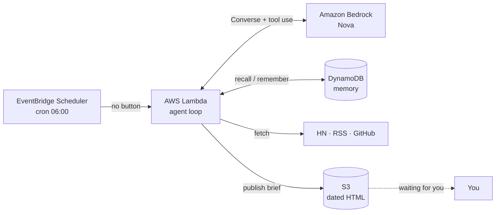

# 🛰️ Sift — your always-on signal analyst

Sift is a personal AI agent that runs **on its own**. On a schedule (no button,
no app to open) it wakes up, pulls the public sources you care about, **remembers
what it already told you**, reasons about what is *genuinely new*, and leaves a
dated brief waiting for you.

## Live demo

- **Dashboard:** http://sift-agent-briefsbucket-79m1iuj8cket.s3-website-us-east-1.amazonaws.com
- **Latest brief:** https://sift-agent-briefsbucket-79m1iuj8cket.s3.us-east-1.amazonaws.com/latest.html

These pages are produced entirely by the agent on a schedule — nobody clicks a button.

---

It's built for the AWS Builder Center *"Build an Always-On Agent"* weekend
challenge, and it deliberately goes past the usual "cron → summarize headlines"
bot in three ways:

1. **A real agentic loop** — Amazon Bedrock **Nova** via the Converse API with
   **tool use**. The model decides what to fetch, searches its own memory, forms
   a thesis, and critiques its confidence.
2. **Persistent memory** — every run records what it reported and the thesis it
   held, in DynamoDB. So Sift *compounds*: it surfaces only new signal and
   explains how the picture is changing over time.
3. **Event-driven by design** — EventBridge Scheduler is the trigger; the same
   handler also runs from any event or a manual "invoke now".

## Architecture



The agent's tools: `fetch_signals`, `recall_memory`, `save_findings`,
`publish_brief`. The model orchestrates them; see `src/agent.py`.

## Run it locally (no AWS account needed)

The bundled `StubLLM` emulates the Bedrock Converse tool-use handshake, so the
*entire* agent loop runs offline:

```bash
# Windows PowerShell
$env:SIFT_LLM="stub"; python scripts/run_local.py

# macOS / Linux
SIFT_LLM=stub python scripts/run_local.py
```

It fetches live sources, writes memory to `./.sift/memory.json`, and opens the
generated brief. Run it twice — the second run's `recall_memory` shows the first
run's thesis, proving memory compounds.

To run locally against **real Bedrock Nova** (needs AWS creds + Nova access):

```bash
SIFT_LLM=bedrock AWS_REGION=us-east-1 python scripts/run_local.py
```

## Deploy to AWS (Free Tier)

Prereqs: an AWS account, the **AWS CLI** (`aws configure`), the **AWS SAM CLI**,
and **Amazon Bedrock Nova access** enabled in your region (Bedrock console →
Model access). No Docker or Lambda layers required — the agent uses only stdlib +
the boto3 already present in the Lambda runtime.

```powershell
# Windows
./scripts/deploy.ps1
```
```bash
# macOS / Linux
./scripts/deploy.sh
```

This provisions: the Lambda, a DynamoDB memory table, a private S3 bucket for
briefs, the IAM roles, and the **EventBridge Scheduler** that fires daily at
06:00 (`America/New_York` by default — change via the `ScheduleExpression` /
`ScheduleTimezone` parameters).

### "Run it now" for the demo

You don't have to wait for 6 AM to prove it works:

```bash
aws lambda invoke --function-name <FunctionName-from-outputs> \
  --payload '{"trigger":"manual"}' out.json && cat out.json

# download the brief it just produced
aws s3 cp s3://<BriefsBucket-from-outputs>/latest.html ./latest.html
```

Take screenshots of (a) the EventBridge schedule, (b) the Lambda invocation
logs, and (c) `latest.html` — that's your "it happened without me" evidence.

## Configuration

| Env var / parameter   | Default                                   | Purpose                        |
|-----------------------|-------------------------------------------|--------------------------------|
| `SIFT_TOPICS`         | AI agents, AWS, serverless, ...           | Steers what counts as signal   |
| `SIFT_RSS_FEEDS`      | AWS What's New, HN frontpage              | Comma-separated feed URLs      |
| `SIFT_MODEL_ID`       | `amazon.nova-lite-v1:0`                    | Any tool-use-capable Bedrock model |
| `ScheduleExpression`  | `cron(0 6 * * ? *)`                        | When it wakes                  |

## Cost

Comfortably within Free Tier for personal use: one short Lambda run/day,
a handful of Nova Lite calls, tiny DynamoDB + S3 usage. Tear down with
`sam delete --stack-name sift-agent`.

## Project layout

```
src/
  handler.py   Lambda entry / local CLI — orchestrates one run
  agent.py     the agentic Converse tool-use loop + system prompt
  tools.py     tool schemas + implementations (fetch/recall/save/publish)
  sources.py   stdlib-only source fetchers (HN, RSS/Atom, GitHub)
  memory.py    DynamoDB (cloud) / JSON (local) memory backends
  llm.py       Bedrock Nova wrapper + deterministic StubLLM
  report.py    Markdown → self-contained HTML brief, to S3 or disk
  config.py    env-driven config
template.yaml  AWS SAM: Lambda + Scheduler + DynamoDB + S3 + IAM
scripts/       run_local.py, deploy.ps1, deploy.sh
```
